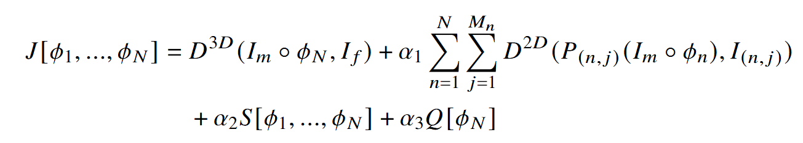

# Image Registration for a Dynamic Breathing Model
Code for the BVM 2025 paper "Image Registration for a Dynamic Breathing Model". 
In this work, we present a new image registration method that determines the torso transformation during the respiratory cycle.
We use a ResNet-LDDMM based registration approach, which incorporates 2D data taken during respiration.

The registration transformation is represented by the following ResNet-LDDMM architecture:

In order to calculate the transformation, we train the network such that it minimizes the energy

As similarity term of the 3D data, the mean squared error (MSE) is used and
as similarity term of the 2D data, the normalized cross-correlation (NCC) is utilised.
For regularization, the gradient of the velocity fields is penalized.
Additionally, as penalty a rigidity term is added to the loss.

# Running the code
This code replicates the experiments that we ran on our data set, which is not publicly available. 
You need to load your data in the form described in the file 
`utils\loadData.py `.
[PyTorch](https://pytorch.org/) is required to run the code. 
We implemented the registration with GPU acceleration.
To register inspiration and expiration images for your data, just run `run.py`.
More advanced settings can be changed in `models\models.py`. 
Different evaluation measures and visualization options are implemented to evaluate the results.

# Data
Our data consists of differently weighted 3D images of the torso recorded in the end-expiratory
and end-inspiratory phase and a set of T2-weighted 2D sequences of the frontal or sagittal plane 
taken during breathing. 
Additionally, segmentations of certain thorax parts in the 3D images are used for evaluation of the registration.
More details on the necessary data can be found in `utils\loadData.py `.

# Reference
If you use this code, please cite our BVM 2025 paper.

    @inproceedings{schulzBVM2025,
      title={Image Registration for a Dynamic Breathing Model},
      author={Schulz, Pia F and Oltmann, Andra and Bostelmann, Johannes and Gildemeister, Ole and Wegner, Franz and Lellmann, Jan and Rostalski, Philipp and Modersitzki, Jan},
      booktitle={BVM Workshop}
      year={2025}
      organization={Springer}
    }